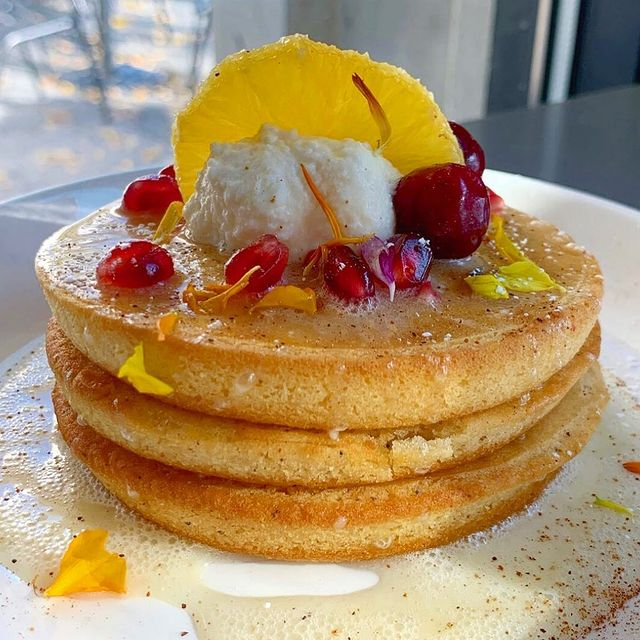

<h1 align="center">Yash Totale</h1>

  
  

<!-- START FOLLOWERS -->

## ⭐️ My Followers

      

> Generated from [this script](https://github.com/YashTotale/YashTotale/blob/main/scripts/generate/get-followers.ts). Add yourself by following 🙂

<!-- END FOLLOWERS -->

## 📊 Stats

  

  

<!-- START RELEASES -->

## ⛳️ Project Releases

- <a href="https://github.com/YashTotale/goodreads-user-scraper/releases/tag/v1.1.0" target="_blank">goodreads-user-scraper@v1.1.0</a> - 2021-09-03
- <a href="https://github.com/YashTotale/react-hash-scroll/releases/tag/v1.4.6" target="_blank">react-hash-scroll@v1.4.6</a> - 2021-08-26
- <a href="https://github.com/hack4impact/logger/releases/tag/v3.0.3" target="_blank">hack4impact/logger@v3.0.3</a> - 2021-04-18
- <a href="https://github.com/hack4impact/jetbrains-plugin/releases/tag/v0.1.0" target="_blank">hack4impact/jetbrains-plugin@v0.1.0</a> - 2021-03-17
- <a href="https://github.com/YashTotale/introspect/releases/tag/v1.1.0" target="_blank">introspect@v1.1.0</a> - 2021-03-16
- <a href="https://github.com/hack4impact/vscode-extension/releases/tag/v0.8.0" target="_blank">hack4impact/vscode-extension@v0.8.0</a> - 2021-03-13
<!-- END RELEASES -->

## 🛠 Featured Projects

| Personal                                                                                                                                                                          | Hack4Impact                                                                                                                                                                                     |
| --------------------------------------------------------------------------------------------------------------------------------------------------------------------------------- | ----------------------------------------------------------------------------------------------------------------------------------------------------------------------------------------------- |
|           |  |
|                 |                  |
|                                      |                 |
|                                |                                                  |
|  |                                                                                                                                                                                                 |

<!-- START WEATHER -->

## 👋 from Pleasanton, CA

**Current Weather**: Sunny. High near 97, with temperatures falling to around 88 in the afternoon. West wind around 10 mph, with gusts as high as 21 mph.

  

🔽 Below are the last 3 pictures posted by <a href="https://www.instagram.com/visittrivalley/" target="_blank"> @visittrivalley</a>!

  

<!-- END WEATHER -->

<!-- START FOOTER -->

---

This <code>README</code> file is generated <strong>every 6 hours</strong>! Last refresh: Tuesday, September 7, 11:09 PM PDT

 

