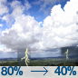

<h1 align="center">Yash Totale</h1>

  
  

## ⭐️ My Followers

<!-- START FOLLOWERS -->

      

<!-- END FOLLOWERS -->

> Generated from [this script](https://github.com/YashTotale/YashTotale/blob/main/scripts/generate/get-followers.ts). Add yourself by following 🙂

## 📊 Stats

  

  

## ⛳️ Project Releases

<!-- START RELEASES -->

- <a href="https://github.com/YashTotale/terminal-all-in-one/releases/tag/v1.12.0" target="_blank" title="terminal-all-in-one">terminal-all-in-one@v1.12.0</a> - 2021-11-09
- <a href="https://github.com/YashTotale/react-hash-scroll/releases/tag/v1.4.7" target="_blank" title="react-hash-scroll">react-hash-scroll@v1.4.7</a> - 2021-10-20
- <a href="https://github.com/YashTotale/goodreads-user-scraper/releases/tag/v1.1.0" target="_blank" title="goodreads-user-scraper">goodreads-user-scraper@v1.1.0</a> - 2021-09-03
- <a href="https://github.com/hack4impact/logger/releases/tag/v3.0.3" target="_blank" title="hack4impact/logger">hack4impact/logger@v3.0.3</a> - 2021-04-18
- <a href="https://github.com/hack4impact/jetbrains-plugin/releases/tag/v0.1.0" target="_blank" title="hack4impact/jetbrains-plugin">hack4impact/jetbrains-plugin@v0.1.0</a> - 2021-03-17
- <a href="https://github.com/YashTotale/introspect/releases/tag/v1.1.0" target="_blank" title="introspect">introspect@v1.1.0</a> - 2021-03-16
- <a href="https://github.com/hack4impact/vscode-extension/releases/tag/v0.8.0" target="_blank" title="hack4impact/vscode-extension">hack4impact/vscode-extension@v0.8.0</a> - 2021-03-13

<!-- END RELEASES -->

## 🛠 Featured Projects

<!-- START PROJECTS -->

|                                                                                                                                              Personal                                                                                                                                               |                                                                                                                                                       Hack4Impact                                                                                                                                                       |
| :-------------------------------------------------------------------------------------------------------------------------------------------------------------------------------------------------------------------------------------------------------------------------------------------------: | :---------------------------------------------------------------------------------------------------------------------------------------------------------------------------------------------------------------------------------------------------------------------------------------------------------------------: |
|              |  |
|                      |                                          |
|                                                  |                                          |
|                                          |                                                                                  |
|  |                                                                                                                                                                                                                                                                                                                         |

<!-- END PROJECTS -->

## 👋 from Pleasanton, CA

**Current Weather**: <!-- START WEATHER --> Patchy fog before 9am. Sunny. High near 72, with temperatures falling to around 67 in the afternoon. Northeast wind 1 to 5 mph.<!-- END WEATHER -->

<!-- START PICTURES -->

  

🔽 Below are the last 5 pictures posted by <a href="https://www.instagram.com/visittrivalley/" target="_blank"> @visittrivalley</a>!

    

<!-- END PICTURES -->

---

This <code>README</code> file is generated <strong>every 3 hours</strong>! Last refresh: <!-- START REFRESH -->Thursday, November 11, 7:03 AM PST<!-- END REFRESH -->

  
  

